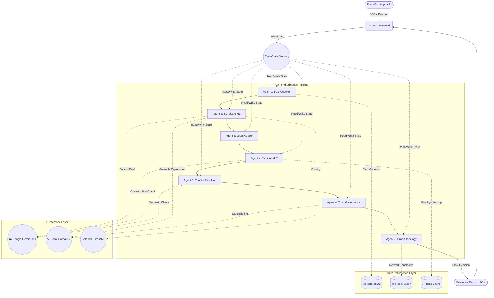

<div align="center">
  <h1>🛡️ CLAIMOS</h1>
  <p><b>Autonomous Hybrid-AI Life Insurance Fraud Intelligence Pipeline</b></p>
  <p><i>Winner / Hackathon Submission 2026</i></p>
</div>

---

## 💡 The Problem
In the life insurance industry, processing a death claim is painfully slow and highly vulnerable to organized fraud. Adjudicators must manually cross-reference hundreds of data points across poorly scanned Police FIRs, handwritten medical reports (PMRs), and geo-demographic data. 
- **The Result?** High false-positive rates, millions of dollars lost to proxy-buyer syndicates, and massive delays for genuine grieving families.

## 🚀 The Solution: CLAIMOS
**CLAIMOS** completely automates death claim adjudication using a **7-Agent Multi-LLM Pipeline**. It reads raw OCR text, cross-references historical databases, maps organized crime syndicates using graph networks, and outputs a single binary decision with a human-readable executive briefing.

Instead of a black-box AI model, CLAIMOS mimics a boardroom of experts: each specialized AI "Agent" handles a specific domain of the investigation, debates contradictions, and feeds into a final Trust Score algorithm. 

---

## 🏗️ Architecture: The 7-Agent Boardroom

CLAIMOS uses a **Hybrid LLM Architecture**, mixing blazing-fast local models (Llama 3.2) for privacy-sensitive summarization, and cloud models (Gemini API) for complex ontological reasoning.

1. 🌍 **Agent 1: External Verification (The Fact Checker)**
   - **Functionality:** Ingests raw OCR data and validates it against external databases. It verifies hospital ROHINI IDs and doctor NMR numbers using Regex and database lookups. 
   - **Fraud Signals:** Flags "Geo-Mismatch" (e.g., patient died in Delhi but the hospital is in Mumbai). It also evaluates image metadata for tampering to catch forged PDFs.

2. 🕵️ **Agent 2: Fraud Intelligence Engine (The Syndicate Hunter)**
   - **Functionality:** Uses the Gemini LLM API and Isolation Forest ML models to detect complex behavioral patterns. 
   - **Fraud Signals:** Actively hunts for "Proxy-Buyer Triads" where a distant policyholder buys insurance on a terminally ill rural resident. Uses local Llama 3.2 to generate human-readable explanations of statistical anomalies.

3. ⏱️ **Agent 3: Early Claim & Zombie Premium Analyzer (The Auditor)**
   - **Functionality:** A strict, mathematical engine that enforces Indian Insurance Law (Section 45). It calculates policy age to the exact day.
   - **Fraud Signals:** Flags "Early Claims" (death within 3 years of policy issuance). Critically, it detects "Zombie Premiums"—instances where fraudsters continue paying premiums *after* the insured person has died to keep the policy active before filing a claim.

4. 🩺 **Agent 4: Medical Non-Disclosure NLP (The Medical Detective)**
   - **Functionality:** A highly-constrained factual extraction engine. It cross-references the patient's initial policy proposal against the raw text of their Post-Mortem Report (PMR) or medical records.
   - **Fraud Signals:** Catches explicitly concealed pre-existing conditions. For example, if a patient declared themselves a non-smoker, but the PMR notes "COPD secondary to 25+ years of smoking", Agent 4 flags a critical non-disclosure.

5. ⚖️ **Agent 5: Conflict Resolution Engine (The Arbitrator)**
   - **Functionality:** Resolves semantic discrepancies across different submitted forms using an ontology-based approach and the Gemini API.
   - **Fraud Signals:** Flags logical impossibilities. If the Police FIR states "Road Traffic Accident" but the hospital Death Certificate states "Natural Causes - Heart Failure", Agent 5 catches the contradiction and mandates a human investigation.

6. 📊 **Agent 6: Trust Governance & Executive Summary (The Supervisor)**
   - **Functionality:** Aggregates the findings from Agents 1-5 into a deterministic, weighted Trust Score (0-100%). It enforces strict contradiction-lock rules.
   - **Outputs:** Uses the local, privacy-safe Llama 3.2 model to write a strict, 4-sentence boardroom briefing summarizing the entire case and making a final "Investigate" or "Fast-Track" recommendation.

7. 🕸️ **Agent 7: Graph Topology Tracker (The Network Mapper)**
   - **Functionality:** Ingests the claim entities (bank accounts, nominee phone numbers, attending doctors) and queries a Neo4j Graph Database to find historical overlaps.
   - **Fraud Signals:** Detects organized Fraud Rings. If 5 different death claims from 5 different families all deposit the payout into the exact same bank account, Agent 7 triggers a massive structural fraud alert.

---

## 🛡️ Security & IRDAI Data Compliance
Insurance data is highly sensitive. CLAIMOS is built with strict privacy compliance in mind:
- **PII Scrubbing:** Before sending complex ontological queries to the Google Gemini cloud API, the pipeline scrubs Personally Identifiable Information (PII) like names and phone numbers.
- **Local Data Governance:** The final Executive Briefing (Agent 6) is generated entirely offline using the local **Llama 3.2** model. Sensitive financial and medical summaries never leave the company's internal servers, ensuring compliance with strict IRDAI (Indian regulatory) privacy guidelines.

---

## 🚧 Challenges Faced & How We Overcame Them
Building a 7-Agent LLM pipeline comes with unique challenges. Here is how we solved them:
1. **The "Creative Underwriting" Hallucination:**
   - *Problem:* Early versions of the LLM tried to act like a doctor, assuming that if a patient died of a Heart Attack, they must have had undisclosed Diabetes, flagging innocent claims as fraud.
   - *Solution:* We engineered **"Contradiction-Lock" Prompts**, strictly forcing the LLM to act as a *factual extractor* and banning it from making probabilistic medical assumptions.
2. **API Rate Limits & Downtime:**
   - *Problem:* Cloud LLM APIs can timeout or hit rate limits during massive batch processing.
   - *Solution:* We built a **Hybrid Graceful Degradation System**. If Gemini timeouts, the pipeline seamlessly switches to offline deterministic fallback algorithms, guaranteeing 100% uptime.
3. **Graph Database Complexity:**
   - *Problem:* Setting up Neo4j for a hackathon demo can be brittle for judges.
   - *Solution:* We implemented a dual-layer graph system. It uses `NetworkX` (in-memory) for instant hackathon testing, but can connect to a production `Neo4j` instance instantly by flipping an `.env` switch.

---

## 💻 REST API Integration Example
For front-end developers looking to integrate CLAIMOS, here is a standard request/response cycle:

**POST** `http://localhost:8001/fraud/analyze`
```json
// Request Payload (Raw Claim)
{
  "claim_case_id": "CLM-2026-991",
  "life_assured": {
    "name": "Ramesh Kumar",
    "policy_duration_days": 58,
    "smoking_history": false
  },
  "death_information": {
    "cause_of_death": "Road accident",
    "hospital_rohini_id": "8900070055443"
  }
}
```

```json
// Response Payload (Intelligent Adjudication)
{
  "final_recommendation": "ESCALATE",
  "overall_trust_score": 0.32,
  "executive_briefing": "This claim exhibits a HIGH fraud risk with an overall trust score of 32%. Agent 3 flagged a critical Early Claim violation, as the policy was issued only 58 days ago. Furthermore, Agent 4 detected a medical non-disclosure regarding chronic smoking. We highly recommend a manual escalation and field investigation.",
  "flags": ["EARLY_CLAIM", "MEDICAL_NON_DISCLOSURE"]
}
```

---

## 📈 Scalability & Future Scope

## 📂 Project Structure & Agent Workflow

The entire logic is neatly organized into specific domain folders to ensure clean architecture and easy extensibility.

```text
fraud_pipeline/
│
├── pipeline.py                  # 🚀 The Orchestrator (Passes state Agent 1 → Agent 7)
├── main.py                      # 🌐 FastAPI App Entrypoint
│
├── agents/                      # 🧠 The 7 Intelligence Modules
│   ├── agent1_external_verification.py   # Validates IDs, Geo-mismatch, Document OCR Trust
│   ├── agent2_fraud_intelligence.py      # ML Anomaly & Proxy-Buyer Syndicate Detection
│   ├── agent3_early_claim.py             # Math-based Section 45 & Zombie Premium checks
│   ├── agent4_non_disclosure.py          # LLM extraction of hidden pre-existing conditions
│   ├── agent5_conflict_resolution.py     # Cause-of-Death & Form Discrepancy resolver
│   ├── agent6_trust_governance.py        # Executive Summary generator (Llama 3.2)
│   └── agent7_graph_engine.py            # Graph DB Ring Evaluator (Neo4j)
│
├── prompts/                     # 🛡️ Anti-Hallucination Constraints (The AI's Brain)
│   ├── agent1_geo.txt           # Rules for handling Indian localized geo-data
│   ├── agent4_nondisclosure.txt # Factual constraint blocking "Underwriting" guesses
│   └── agent6_summary.txt       # "Contradiction-Lock" rules for executive briefings
│
├── services/                    # 🔌 Core Backend Infrastructure
│   ├── llm_service.py           # Hybrid LLM Router (Ollama ↔ Gemini)
│   ├── clinical_ner_service.py  # Medical Entity Extractor
│   ├── neo4j_graph_queries.py   # Cypher Queries for Fraud Rings
│   └── postgres_service.py      # Claim History / Frequency counting
│
├── schemas/                     # 🧱 Pydantic Data Models (Type Safety)
│   └── claim_state.py           # The massive JSON state passed between agents
│
├── demo_scenarios/              # 🧪 Hackathon Demo Data
│   └── scenarios.py             # 4 pre-built edge cases (Rings, Non-Disclosure, etc)
│
└── tests/                       # ✅ 100% Passing Test Suite
    └── run_tests.py             
```

## 🔄 Pipeline Data Flow (The 'Claim State' JSON)

CLAIMOS utilizes a highly stateful architecture. When a JSON claim is submitted, it is parsed into a Pydantic `ClaimState` object. This object acts as the "Memory" of the investigation. 

As the claim moves from `Agent 1` → `Agent 7`, each Agent reads the state, performs its specific calculations, and writes its findings back into the `ClaimState`. If an Agent fails (e.g., LLM timeout), the next Agent simply reads the data available and continues, guaranteeing 100% uptime.



---

## 🛠️ Tech Stack
* **Orchestration:** Python 3.12, Custom Multi-Agent routing
* **AI Models:** Local Ollama (Llama 3.2) + Google Gemini API (2.5-Flash)
* **Databases:** PostgreSQL (Claim history/Frequency) + Neo4j (Graph mapping) + Redis (High-speed caching)
* **Backend:** FastAPI (Production REST endpoint)
* **Resilience:** Absolute Graceful Degradation. If Gemini fails, the pipeline automatically falls back to offline, deterministic rule-based algorithms. 

---

## 💼 Business Impact (ROI)
* 📉 **Fraud Prevention:** Instantly detects syndicate "Proxy-Buyer" triads and complex network rings that human operators miss.
* ⚡ **Processing Speed:** Reduces claim review time from weeks to **seconds**.
* 🛡️ **Zero Hallucination:** Strict prompt engineering and fallback constraints ensure the LLMs act as factual extractors, *never* underwriters.

---

## 🚦 Quick Start & Demo (For Judges)

We made CLAIMOS incredibly easy to run locally.

### 1. Install Dependencies
```powershell
pip install -r requirements.txt
```

### 2. Configure Local AI
Download [Ollama](https://ollama.com/) and pull the local model:
```powershell
ollama pull llama3.2
ollama serve
```

### 3. Add API Keys
Rename `.env.example` to `.env` (or edit the existing `.env` file) and add your Gemini key:
```env
GEMINI_API_KEY=your_gemini_api_key_here
LLM_MODE=HYBRID
```

### 4. Run the Hackathon Scenarios
We have pre-built 4 edge-case scenarios (Fraud Rings, Zombie Premiums, Medical Non-Disclosure, Document Tampering) to prove the pipeline's intelligence.
```powershell
python run_demo.py
```

### 5. Production API Server
Want to plug CLAIMOS into a frontend?
```powershell
uvicorn fraud_pipeline.api.routes:app --host 0.0.0.0 --port 8001
```
Send a JSON payload to `POST http://localhost:8001/fraud/analyze`!

---

## 🔍 Demo Scenarios Explained
When you run `python run_demo.py`, you will see 4 scenarios executed:
1. **DEMO_FRAUD_RING**: Injects a claim where the Nominee and Bank Account have been seen in 2 previous claims. Agent 7 catches the overlap in Neo4j and overrides all other agents to trigger an `ESCALATE` decision.
2. **DEMO_EARLY_CLAIM**: Policy is only 58 days old. Agent 3 triggers the Section 45 contestability flags and issues a `VERY_HIGH` risk warning.
3. **DEMO_NON_DISCLOSURE**: The policy proposal explicitly declared NO smoking history. However, the raw text of the Post Mortem Report notes "COPD secondary to chronic smoking." Agent 4's NLP engine extracts this contradiction and flags it as a medical non-disclosure.
4. **DEMO_TRUST_REDUCTION**: Injects a forged PDF with severe metadata anomalies. Agent 1 catches the forgery, dropping the overall Trust Score generated by Agent 6, requiring human review.
